# 💰 MisFinanzas — Frontend

> Aplicación web de **finanzas personales** que digitaliza y automatiza el control de gastos e ingresos recurrentes: registra tus obligaciones, genera los pendientes de cada mes, marca pagos y recepciones, y visualiza en un dashboard **lo real frente a lo proyectado**.

Este repositorio contiene el **frontend en Angular** que consume la API REST de MisFinanzas (backend en .NET).

**Versión:** `v1.0-frontend` · **Estado:** MVP v1 terminado ✅

---


## 📑 Tabla de contenidos

1. [Capturas de pantalla](#-capturas-de-pantalla)
2. [Características](#-características)
3. [Tecnologías](#-tecnologías)
4. [Arquitectura y conceptos](#-arquitectura-y-conceptos)
5. [Estructura del proyecto](#-estructura-del-proyecto)
6. [Requisitos previos](#-requisitos-previos)
7. [Instalación y ejecución](#-instalación-y-ejecución)
8. [Configuración del entorno](#-configuración-del-entorno)
9. [Conexión con el backend](#-conexión-con-el-backend)
10. [Rutas de la aplicación](#-rutas-de-la-aplicación)
11. [Sistema de diseño](#-sistema-de-diseño)
12. [Autenticación y seguridad](#-autenticación-y-seguridad)
13. [Reglas de negocio en la UI](#-reglas-de-negocio-en-la-ui)
14. [Notas y limitaciones conocidas](#-notas-y-limitaciones-conocidas)
15. [Mejoras futuras](#-mejoras-futuras)
16. [Autora](#-autora)

---

## 📸 Capturas de pantalla

### Ingresar / Crear cuenta
Pantalla de autenticación con panel de marca a la izquierda y formulario con pestañas a la derecha.

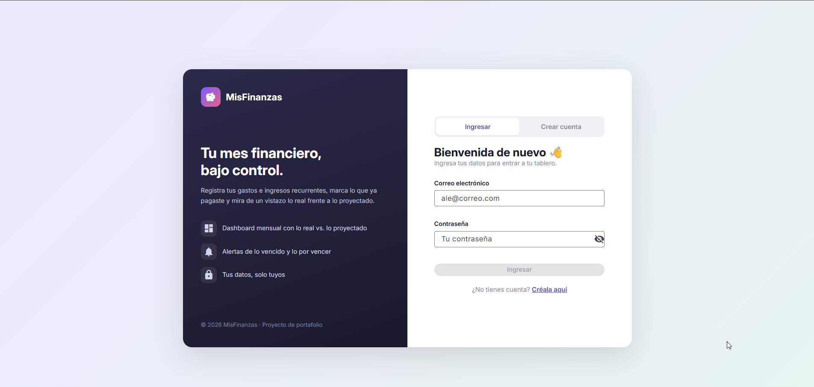

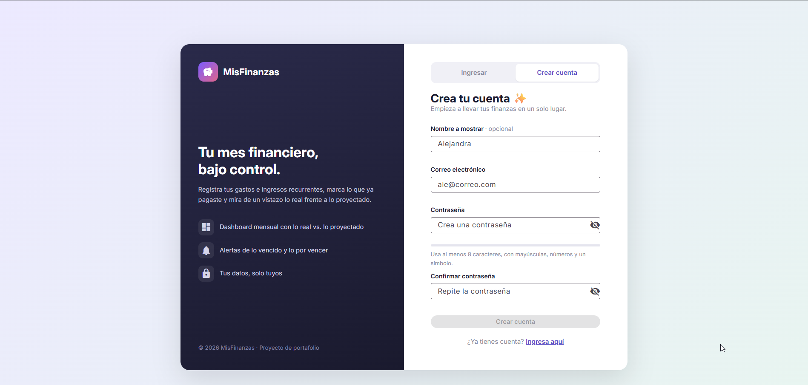

### Dashboard
La foto financiera del mes: 6 métricas (reales vs. proyectadas) y los listados de gastos e ingresos con su estado.

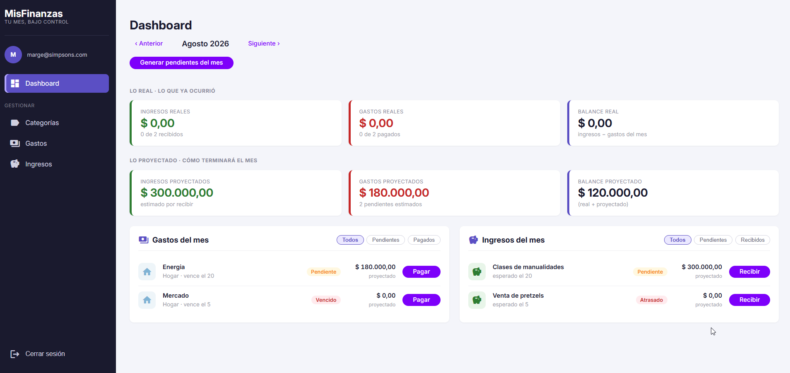

### Categorías
Gestión de categorías en tarjetas, con buscador y conteo de uso.

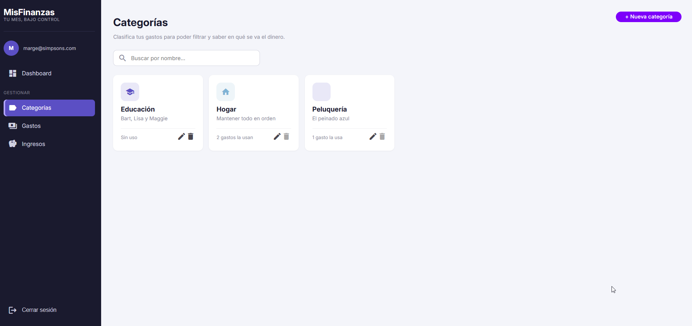

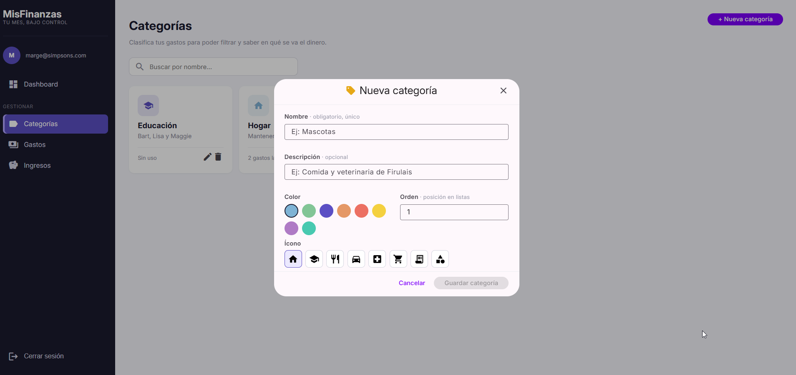

### Gastos
Plantillas de gastos recurrentes en tabla, con filtros y formulario en modal.

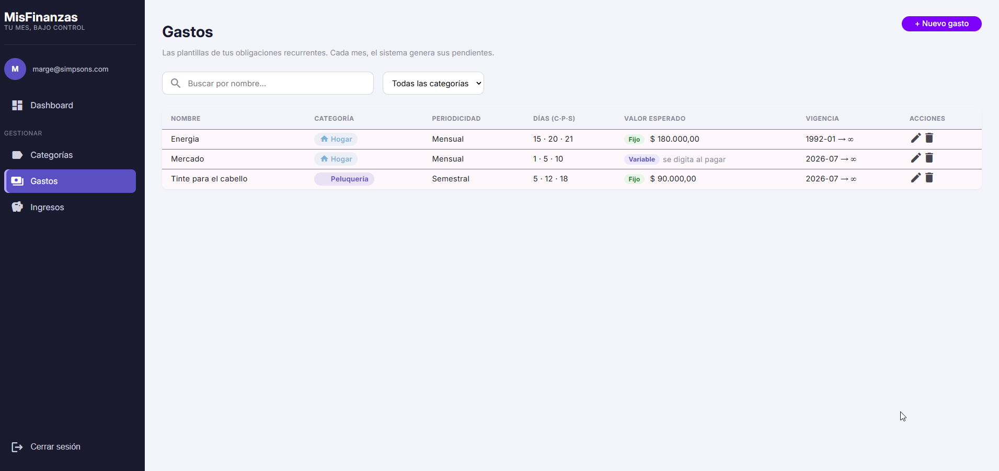

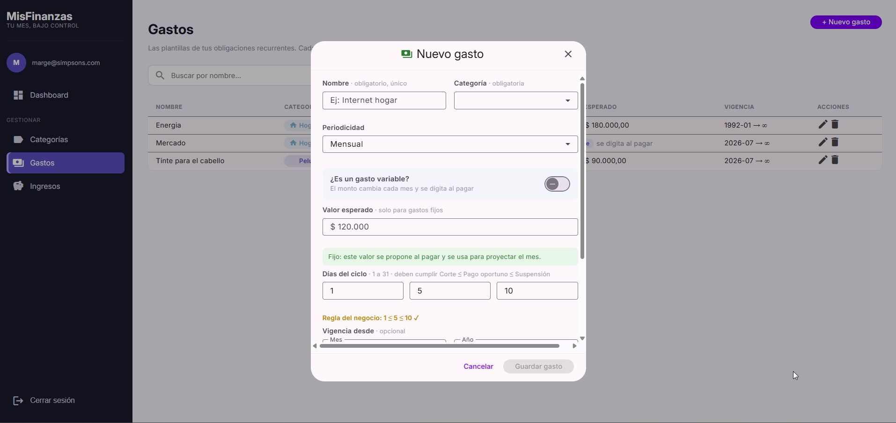

### Ingresos
Plantillas de ingresos recurrentes.

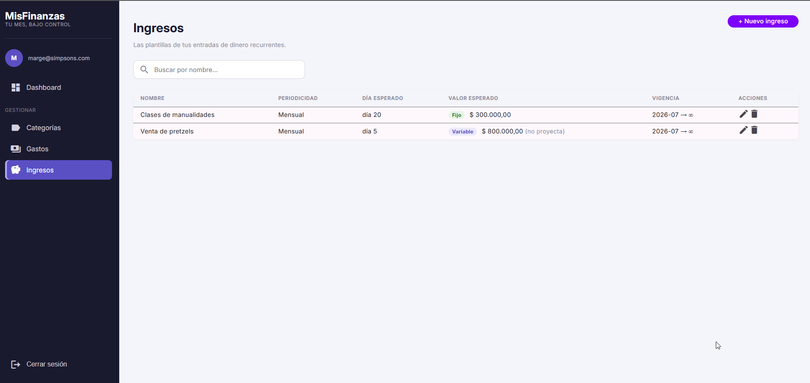

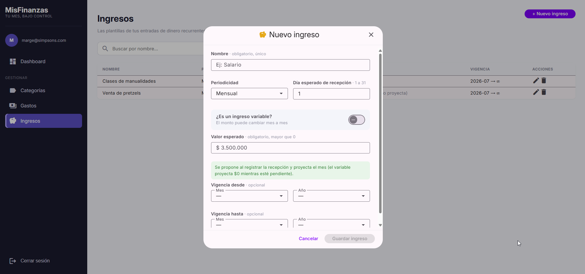

### Modales de acción
Registrar pago, registrar recepción y confirmaciones de desactivar/revertir.

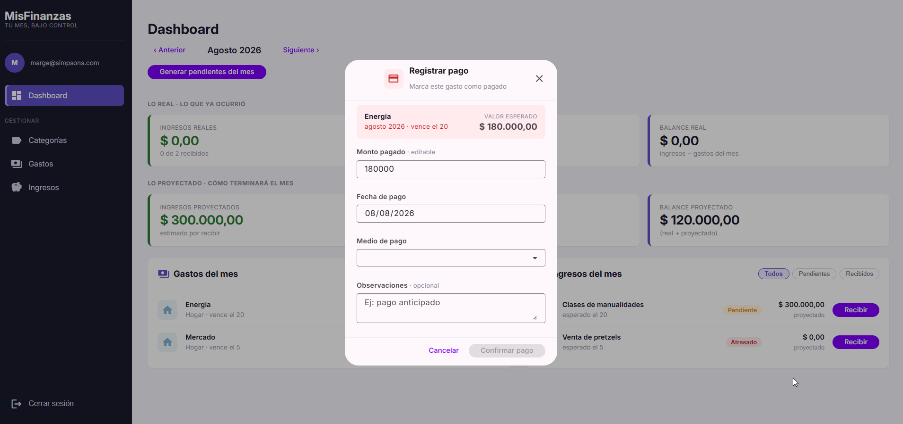

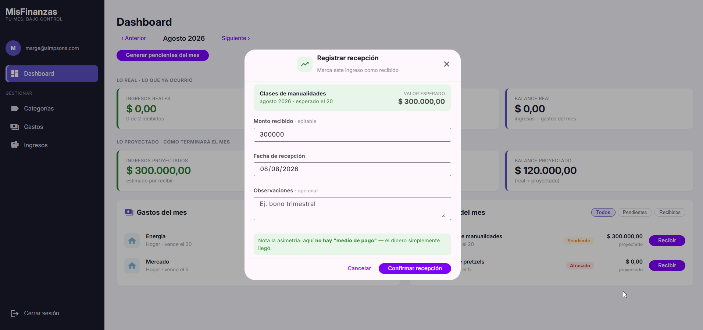

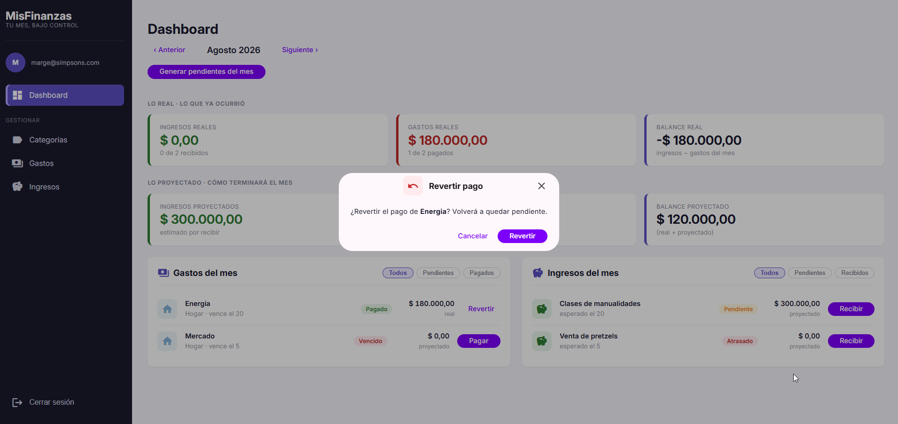

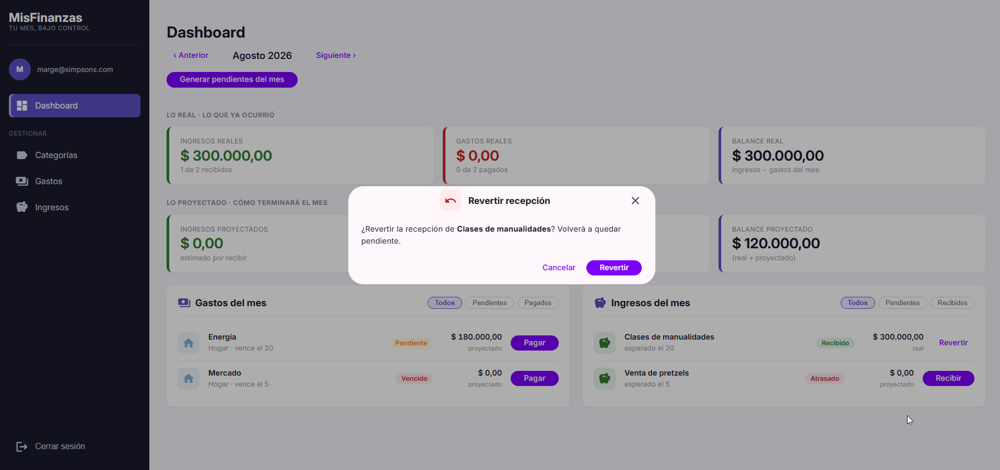
---

## ✨ Características

### Autenticación
- **Crear cuenta** y **Ingresar** con validación en el cliente.
- **JWT** guardado en `sessionStorage` (sin "recordarme" en el MVP).
- **Interceptor** que añade la cabecera `Authorization: Bearer {token}` a cada petición automáticamente.
- **Guard** que protege las rutas privadas: sin sesión, redirige a *Ingresar*.
- **Manejo de sesión expirada:** ante un `401`, borra el token, redirige a *Ingresar* y avisa "Sesión expirada".

### Categorías (CRUD)
- Listado en **tarjetas** con ícono y color por categoría.
- **Buscador** por nombre en vivo.
- **Conteo de uso** ("N gastos la usan") calculado en el cliente.
- Crear / editar en **modal**; el botón de desactivar se **deshabilita** si la categoría está en uso (RF-08).

### Gastos (CRUD)
- Tabla de **plantillas** con categoría, periodicidad, días del ciclo (Corte · Pago · Suspensión), valor esperado y vigencia.
- **Buscador** + **filtro por categoría**.
- Formulario completo en modal, con:
  - Interruptor **fijo/variable** (el valor esperado se oculta y deja de ser obligatorio si es variable).
  - **Validación entre campos**: corte ≤ pago ≤ suspensión.
  - Vigencia con selectores **Mes + Año**.

### Ingresos (CRUD)
- Espejo de Gastos, más simple (sin categoría ni días de ciclo).
- Refleja la **asimetría**: el ingreso variable **sí** tiene valor esperado.

### Dashboard
- **Selector de mes** (‹ ›).
- **6 métricas**: ingresos, gastos y balance — reales y proyectados.
- **Dos listados** (gastos e ingresos del mes) con chips de estado e indicadores **Vencido / Atrasado** (calculados por el backend).
- **Generar pendientes** del mes.
- **Pagar / Recibir / Revertir** mediante modales.
- **Filtros** por estado (Todos / Pendientes / Pagados-Recibidos).

### Localización
- Formato **es-CO**: montos en COP (miles con `.`, decimales con `,`), fechas y meses en español.

---

## 🛠️ Tecnologías

| Tecnología | Uso |
|---|---|
| **Angular** (standalone components, control flow `@if`/`@for`) | Framework SPA |
| **TypeScript** | Lenguaje |
| **Angular Material** | Librería de componentes (tema Material 3) |
| **RxJS** | Programación reactiva (Observables) |
| **Angular Signals** | Estado reactivo |
| **Reactive Forms** | Formularios y validación |
| **CSS Variables** | Sistema de diseño centralizado |
| **Google Fonts (Inter)** | Tipografía |

---

## 🧱 Arquitectura y conceptos

La app sigue una arquitectura por **capas del lado del cliente**:

- **Componentes** (`pages/`, `layout/`, diálogos): la parte visible (HTML + CSS + TS).
- **Servicios** (`services/`): la lógica y la comunicación con la API. Los componentes nunca llaman a la API directamente.
- **Modelos** (`models/`): interfaces de TypeScript que reflejan los DTOs del backend.
- **Guards** (`guards/`): control de acceso a rutas.
- **Interceptores** (`interceptors/`): lógica transversal para las peticiones HTTP (token, errores).

**Conceptos aplicados:** inyección de dependencias, Observables y suscripciones, rutas anidadas, `routerLinkActive`, signals y `computed`, validadores personalizados y de grupo, operadores RxJS (`tap`, `forkJoin`, `catchError`), `MatDialog`, y *design tokens* con variables CSS.

```
Componente  --->  Servicio  --->  HttpClient  --->  [Interceptor añade el token]  --->  API .NET
     ^                                                                                    |
     +--------------------------  responde JSON, se pinta en pantalla  <------------------+
```

---

## 📂 Estructura del proyecto

```
frontend/
├── src/
│   ├── index.html                 # HTML único (SPA) + fuentes
│   ├── styles.css                 # Variables de diseño + estilos compartidos (DRY)
│   ├── material-theme.scss        # Tema de Angular Material (paleta violeta, Inter)
│   ├── environments/
│   │   ├── environment.ts             # URL del backend (producción)
│   │   └── environment.development.ts # URL del backend (desarrollo)
│   └── app/
│       ├── app.config.ts          # Providers globales (router, http, interceptores, locale)
│       ├── app.routes.ts          # Mapa de rutas (auth + app protegida, anidadas)
│       ├── app.ts                 # Componente raíz (solo el router-outlet)
│       │
│       ├── auth-layout/           # Marco de autenticación (panel + pestañas)
│       ├── layout/                # Marco de la app (barra lateral + contenido)
│       │
│       ├── models/                # Interfaces (auth, category, expense, income, dashboard, payment-method)
│       ├── services/              # AuthService, CategoryService, ExpenseService, IncomeService,
│       │                          #   DashboardService, PaymentMethodService
│       ├── guards/                # authGuard
│       ├── interceptors/          # authInterceptor, errorInterceptor
│       ├── shared/                # options.ts (constantes: meses, años, periodicidades)
│       │
│       ├── confirm-dialog/        # Modal de confirmación reutilizable
│       ├── message-dialog/        # Modal de mensaje reutilizable
│       │
│       └── pages/
│           ├── login/             # Formulario de ingreso
│           ├── register/          # Formulario de registro
│           ├── dashboard/         # Dashboard + pay-dialog + receive-dialog
│           ├── categories/        # Categorías + category-dialog
│           ├── expenses/          # Gastos + expense-dialog
│           └── incomes/           # Ingresos + income-dialog
```

---

## ✅ Requisitos previos

- **Node.js LTS** (versión par: 20, 22 o 24 — se recomienda la última LTS).
- **Angular CLI** (`npm install -g @angular/cli`).
- El **backend de MisFinanzas** corriendo en local (ver la sección [Conexión con el backend](#-conexión-con-el-backend)).
- Navegador **Chrome** (objetivo oficial del MVP).

---

## 🚀 Instalación y ejecución

Desde la carpeta `frontend/`:

```bash
# 1. Instalar las dependencias
npm install

# 2. Levantar el servidor de desarrollo (abre el navegador en http://localhost:4200)
ng serve -o
```

> ⚠️ **Importante:** antes de usar la app, **levanta el backend** en `https://localhost:7002`. Si el backend no está corriendo, verás errores de red y no podrás ingresar.

Para compilar una versión de producción:

```bash
ng build
```

Los archivos generados quedan en `dist/`.

---

## ⚙️ Configuración del entorno

La URL del backend se centraliza en los archivos de entorno:

**`src/environments/environment.development.ts`** (desarrollo):
```ts
export const environment = {
  production: false,
  apiUrl: 'https://localhost:7002/api'
};
```

**`src/environments/environment.ts`** (producción):
```ts
export const environment = {
  production: true,
  apiUrl: 'https://localhost:7002/api'
};
```


---

## 🔌 Conexión con el backend

El frontend consume la API REST de MisFinanzas. Endpoints usados:

| Método | Ruta | Descripción |
|---|---|---|
| `POST` | `/api/auth/register` | Crear cuenta |
| `POST` | `/api/auth/login` | Ingresar (devuelve el token) |
| `GET/POST` | `/api/categories` | Listar / crear categorías |
| `PUT/DELETE` | `/api/categories/{id}` | Editar / desactivar categoría |
| `GET/POST` | `/api/expenses` | Listar / crear gastos |
| `PUT/DELETE` | `/api/expenses/{id}` | Editar / desactivar gasto |
| `POST` | `/api/expenses/generate-monthly?month=YYYY-MM` | Generar pendientes |
| `POST` | `/api/expenses/{id}/months/{month}/pay` | Registrar pago |
| `POST` | `/api/expenses/{id}/months/{month}/revert` | Revertir pago |
| `GET/POST` | `/api/incomes` | Listar / crear ingresos |
| `PUT/DELETE` | `/api/incomes/{id}` | Editar / desactivar ingreso |
| `POST` | `/api/incomes/generate-monthly?month=YYYY-MM` | Generar pendientes |
| `POST` | `/api/incomes/{id}/months/{month}/receive` | Registrar recepción |
| `POST` | `/api/incomes/{id}/months/{month}/revert` | Revertir recepción |
| `GET` | `/api/dashboard?month=YYYY-MM` | Métricas + listados del mes |
| `GET` | `/api/payment-methods` | Catálogo de medios de pago |

### CORS
El backend debe permitir peticiones desde el origen del frontend (`http://localhost:4200`). En `Program.cs`:

```csharp
builder.Services.AddCors(options =>
{
    options.AddPolicy("AllowFrontend", policy =>
        policy.WithOrigins("http://localhost:4200")
              .AllowAnyHeader()
              .AllowAnyMethod());
});
// ...
app.UseCors("AllowFrontend"); // antes de UseAuthentication / UseAuthorization
```

---

## 🗺️ Rutas de la aplicación

| Ruta | Pantalla | Acceso |
|---|---|---|
| `/login` | Ingresar | 🔓 Público (dentro del marco de auth) |
| `/register` | Crear cuenta | 🔓 Público (dentro del marco de auth) |
| `/dashboard` | Dashboard | 🔒 Protegido (guard) |
| `/categories` | Categorías | 🔒 Protegido |
| `/expenses` | Gastos | 🔒 Protegido |
| `/incomes` | Ingresos | 🔒 Protegido |
| `/` | Redirige a `/dashboard` (y el guard envía a `/login` si no hay sesión) | — |

Las rutas usan **layouts anidados**: un marco de autenticación (panel + pestañas) para las públicas, y un marco con **barra lateral** para las protegidas.

---

## 🎨 Sistema de diseño

Todo el diseño se centraliza con **variables CSS** en `src/styles.css` (`:root`), para cambiar colores, tipografía o tamaños desde un solo lugar.

```css
:root {
  --font-base: 'Inter', system-ui, sans-serif;

  --color-primary: #5b4fc4;   /* morado de marca */
  --color-income: #2e7d32;    /* verde ingresos */
  --color-expense: #c62828;   /* rojo gastos */
  --color-sidebar: #1a1a2e;
  --color-bg: #f4f5fa;
  --color-surface: #ffffff;
  --color-muted: #8a8a9a;

  --radius: 10px;
  --shadow-card: 0 1px 3px rgba(0, 0, 0, 0.06);
  /* ...tipografía, tamaños, bordes... */
}
```

- **Tipografía:** [Inter](https://fonts.google.com/specimen/Inter) (cargada en `index.html`).
- **Tema Material:** paleta **violeta** (`mat.$violet-palette`) con densidad compacta, en `material-theme.scss`.
- **Estilos compartidos (DRY):** tablas (`.data-table`), encabezados (`.page-header`), buscadores (`.search-box`), chips y mensajes viven una sola vez en `styles.css`.

---

## 🔐 Autenticación y seguridad

1. **Ingresar:** el usuario envía correo y contraseña → el backend responde con un **JWT** → se guarda en `sessionStorage`.
2. **Interceptor:** cada petición saliente lleva `Authorization: Bearer {token}` automáticamente.
3. **Guard:** al navegar a una ruta protegida, verifica que haya sesión; si no, redirige a `/login`.
4. **Sesión expirada:** si una petición devuelve `401`, el interceptor de errores borra el token, redirige a `/login` y muestra "Sesión expirada".
5. **Cerrar sesión:** borra el token y vuelve a `/login`.

---

## 📐 Reglas de negocio en la UI

- **Periodicidad** es un enum correlativo: `1=Mensual, 2=Bimestral, 3=Trimestral, 4=Semestral, 5=Anual`.
- **Gasto variable:** no lleva valor esperado (se digita al pagar). El formulario oculta el campo.
- **Ingreso variable:** sí lleva valor esperado (pero el backend lo proyecta como $0 mientras esté pendiente).
- **Días del ciclo (gastos):** deben cumplir `corte ≤ pago ≤ suspensión` (validado en el formulario y en el backend).
- **Vencido / Atrasado:** lo **calcula el backend** y devuelve; el frontend solo lo muestra.
- **Desactivar categoría en uso:** el botón se deshabilita; si aun así ocurre, el backend responde `409` y se muestra el aviso.

---

## ⚠️ Notas y limitaciones conocidas

- El endpoint de **registro no emite token**, por lo que al crear la cuenta se muestra un mensaje de éxito y se redirige a *Ingresar* (no hay auto-login).
- **"Recordarme"** y **"olvidé mi contraseña"** no están en el MVP (no hay soporte en el backend).
- Navegador objetivo del MVP: **Chrome desktop** (no optimizado para móvil).
- La aplicación asume que el backend corre en **local** (`https://localhost:7002`).

---

## 🔮 Mejoras futuras

- Consolidar por completo los estilos de los diálogos y formularios de auth en la capa compartida.
- Auto-login tras el registro (requiere que el backend emita token).
- Diseño responsive para móvil.
- Carga perezosa (*lazy loading*) de las rutas.
- Pruebas unitarias de servicios y componentes.
- Paginación / ordenamiento en las tablas.

---

## 👩‍💻 Autora

**Alejandra Hincapié** — Estudiante de Ingeniería de Sistemas
GitHub: [@lahincapie](https://github.com/lahincapie)

Proyecto personal de portafolio. Backend en **.NET 9** (API REST con 49 tests unitarios y CI en GitHub Actions) + frontend en **Angular**.

---

<p align="center">Hecho con 💜 y mucho café.</p>
